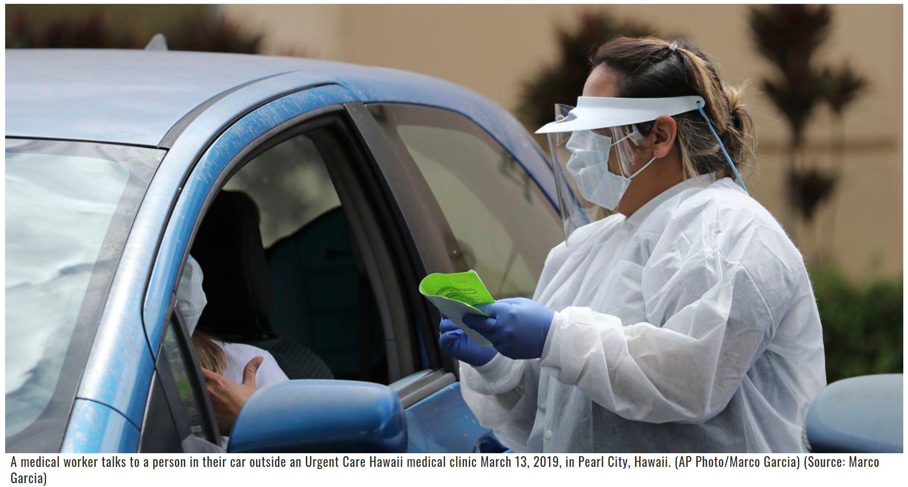

# LIST: Cancellations, closures mount as Hawaii seeks to stop spread of virus
 Here is the latest list of what will be cancelled or closing on our Island due to the **Covid-19**. Due to the high risk of spread, the *CDC* urge people not to gather in groups of **50 people or more**, will the *White House* says that gatherings should not exceed **10 people.** While this list is here to protect the residents of Hawaii, it hurts many families and local companies. While I cannot be home in Hawaii myself, I can still try and monitor the situation from school.  [This article](https://www.hawaiinewsnow.com/2020/03/17/list-cancellations-closures-grow-virus-cases-mount/) displays extensive lists and extra links that Hawaii residents can use to see what is canceled or closed.

> A flurry of events locally and   nationally have been canceled amid growing efforts to prevent the broader spread of the coronavirus. This list is far from exhaustive, but it’s meant to offer a scale and scope of the impacts to communities.

Below is an image of a medical worker talking to a person in their car outside of the Urgent Care medical clinic in Pearl City

See my image 

In addition:
 - Hawaii [statewide](https://www.hawaiinewsnow.com/2020/04/01/state-reports-new-coronavirus-cases-bringing-statewide-total/) total of Covid-19 cases are at 258 cases.
 - A nurse worked for a week while [infected](https://www.hawaiinewsnow.com/2020/04/01/nurse-worked-week-while-infected-with-coronavirus-hospital-wasnt-testing-staff/) with the coronavirus. The hospital wasn't testing staff.
 - Lastly [See's Candies](https://www.kitv.com/story/41957685/sees-candies-suspends-production-because-of-the-coronavirus) suspends production because of the coronavirus
